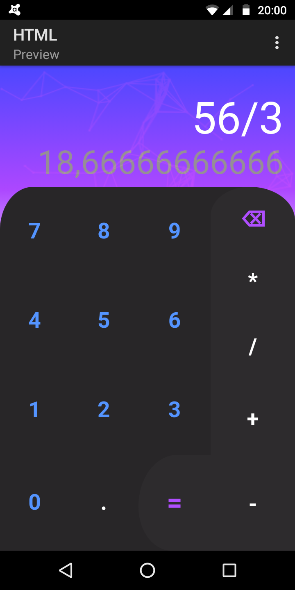

# calculadora simples(1°projeto em javascript)
Apenas uma simples calculadora ,porém totalmente funcional
E com belo design.um projeto de treino da linguagem javascript que estou tentando aprender
Através de vídeos do YouTube.

Projeto totalmente criado em um celular 'Moto G6'Play'
Já que não possuo computador.

Para abrir, basta fazer download dos arquivos para um celular Android
E executar o arquivo "index.html"(obs:todos os arquivos devem estar na mesma pasta) 

